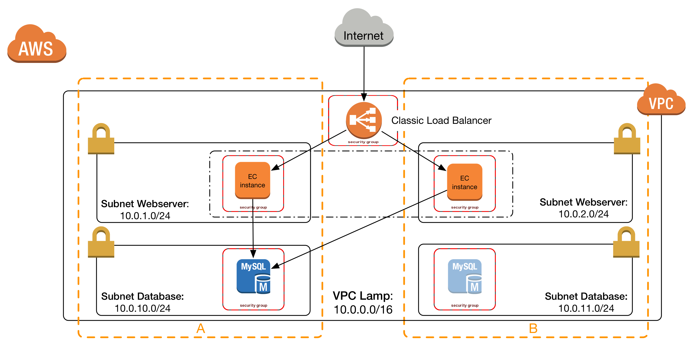
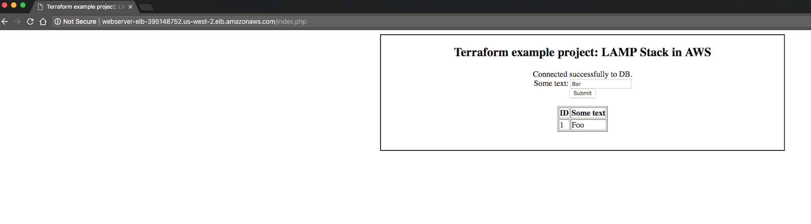

#  LAMP Stack (for AWS)

The infrastructure (see Fig. 1) of a good old LAMP Stack is used as an (not too trivial, but also not too complex) example
to showcase how to setup a Terraform project. [Terragrunt](https://github.com/gruntwork-io/terragrunt) is used to deploy 
to different environments (QA, PROD, etc) while keeping code [DRY](https://en.wikipedia.org/wiki/Don%27t_repeat_yourself).

<p>
    
 <em>Figure 1: LAMP Stack infrastructure in AWS</em>
</p>

<p>
    
 <em>Figure 2: Test website of the LAMP Stack when up and running</em>
</p>

*Note: Checkout [v0.1](https://github.com/cloudetc/lamp-stack-for-aws/releases/tag/v0.1) of this repo to see the version belonging to the Heise Developer Article
 [Terraform in der Praxis: LAMP-Stack in der Cloud](https://www.heise.de/developer/artikel/Terraform-in-der-Praxis-LAMP-Stack-in-der-Cloud-3961117.html).*

## Requirements

* AWS Account (there is [free tier](https://aws.amazon.com/free/) if you don't have an account yet)
* aws-cli 1.10.33
* Packer v0.12.3
* Terraform v0.10.0
* librarian-chef 0.0.4

## Deploy LAMP stack

We use Terraform and [Packer](https://www.packer.io) to do so. It takes only 2 "steps" to bring up the complete LAMP stack.

As a prerequisite, [create a profile](https://docs.aws.amazon.com/cli/latest/userguide/cli-multiple-profiles.html) 
for your AWS account and name it `myaccount`.

### Create webserver image

```
AWS_PROFILE="myaccount" packer build \
        -var "region=us-west-2" \
        -var "build_version=1" \
        packer.json
```

Packer creates machine images for the webservers of the LAMP stack (orange boxes in Fig. 1).

Packer first launches an EC2 instance, then installs apache2 and PHP on it, and finally saves
a snapshot of that provisioned instance as an Amazon machine image (AMI). 
This Packer details are configured in the [lamp.json](packer.json).
 
The AMI can be used to spin up several webservers of the exact same kind. 
This is less error-prone (single point of testing) and faster in scaling than 
provisioning each single EC2 instance after launching it.

### Create infrastructure

Deploy infrastructure of the LAMP Stack to AWS for different environments (<environment> can be qa or prod):

```
cd <environment>/
terragrunt init
AWS_PROFILE=myaccount terragrunt apply
```

The output you will see is similar to the following:

    Apply complete! Resources: 18 added, 0 changed, 0 destroyed.
        
    Outputs:
     
    elb_dns_name = webserver-elb-1983426762.us-west-2.elb.amazonaws.com
    
 
Open `webserver-elb-1983426762.us-west-2.amazonaws.com` (which is different in your case and each time you create the LAMP Stack)
in your browser and have a play with the test website (see Fig. 2), which adds and reads data from a database using PHP.

## Tear down LAMP stack

```
cd <environment>/
terragrunt init
AWS_PROFILE=myaccount terragrunt destroy
```
